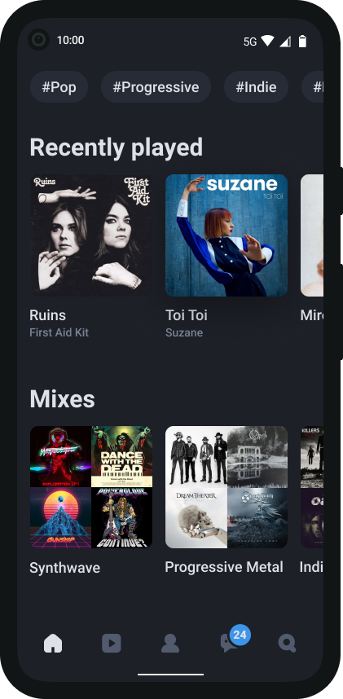

# LoFi

# Описание
Прототип музыкального стримингового сервиса по собственному дизайну. Написано на flutter. Работа с БД выполнена с помощью Firebase (логин, регистрация). Остальное взаимодействие с бэкэндом не реализовано.

# UI:

https://user-images.githubusercontent.com/49438937/117773426-f6036200-b240-11eb-8429-301e3ee5f4b7.mp4

